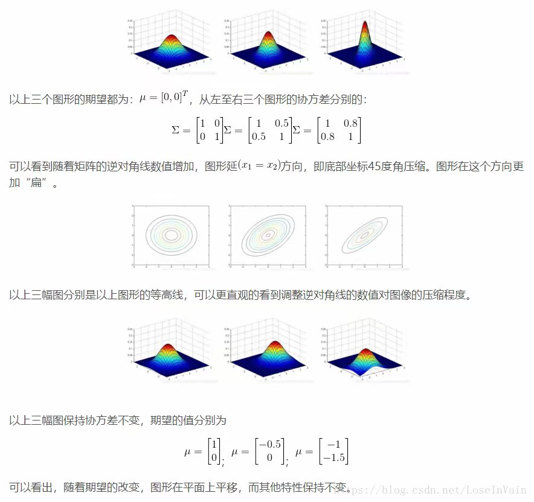

# Kalman 滤波
参考资料:
1. [b站DR_CAN的kalman滤波视频](https://www.bilibili.com/video/BV12D4y1S7fU/?spm_id_from=333.337.search-card.all.click)
2. 控制之美
3. 卡尔曼滤波及其实时应用
4. [卡尔曼滤波的Python实现](https://github.com/rlabbe/Kalman-and-Bayesian-Filters-in-Python)：详细介绍了卡尔曼滤波的理论和实践，并提供了代码示例。
5. [卡尔曼滤波MATLAB教程](https://www.mathworks.com/help/control/ug/design-kalman-filter.html)：MATLAB提供的卡尔曼滤波教程，涵盖了基本原理和实现方法。

## 什么是 Kalman 滤波
**Kalman 滤波就是将两个不准确的结果进行数据融合，得到一个更加准确的结果。**

## 数学基础
### 基于最小均方误差的数据融合
我们直接看一个例子
> 用两把尺子测量一个物体的长度。一个尺子的测量值是8，方差是1；另一把尺子的测量值是9，方差是3。那么问题来了，这个物体的长度是多少呢？更准确的说，这个物体长度为多少时可能性最大？

一种简单的方法，求两者的平均值
$$\frac{8+9}{2} =8.5$$

但这并没有用到两者的方差

从直觉上来讲，我们认为方差越大，数据越不可信

$$
\begin{aligned}
x_1 &= x + v_1,\quad v_1 \sim \mathcal{N}(0,1) \\
x_2 &= x + v_2,\quad v_2 \sim \mathcal{N}(0,3) \\
\end{aligned}
$$
$$
\begin{aligned}
\hat{x} &= x_1 + K(x_2-x_1)\\ &= (1-K)x_1 + Kx_2
\end{aligned}
$$
求 $K$，使估计值 $\hat{x}$ 与真实值 $x$ 的误差最小，并同时满足无偏估计。

均方误差（MSE）定义为估计值误差平方的期望：
$$
\text{MSE} = \mathbb{E}\left[(\hat{x} - x)^2\right]
$$
将 $\hat{x} = (1-K)x_1 + K x_2$ 和 $x_1$, $x_2$ 的表达式代入：

$$
\begin{aligned}
\hat{x} - x &= [(1-K)x_1 + K x_2] - x \\
&= (1-K)(x + v_1) + K(x + v_2) - x \\
&= (1-K) v_1 + K v_2
\end{aligned}
$$

只剩下噪声组合：
$$
\hat{x} - x = (1-K) v_1 + K v_2
$$
现在对误差的平方求期望：
$$
\begin{aligned}
\text{MSE} &= \mathbb{E}\left[\left[(1-K) v_1 + K v_2\right]^2\right] \\
&= (1-K)^2 \mathbb{E}[v_1^2] + 2 (1-K) K \mathbb{E}[v_1 v_2] + K^2 \mathbb{E}[v_2^2]
\end{aligned}
$$
由于噪声 $v_1$, $v_2$ 互不相关，交叉项 $\mathbb{E}[v_1 v_2] = 0$，且 $\mathbb{E}[v_1^2] = \sigma_1^2 = 1$，$\mathbb{E}[v_2^2] = \sigma_2^2 = 3$。因此：
$$
\begin{aligned}
\text{MSE} &= (1-K)^2 \sigma_1^2 + K^2 \sigma_2^2\\ &= (1-K)^2 \times 1 + K^2 \times 3
\end{aligned}
$$

对 $K$ 求一阶导数并令其等于零：
$$
\begin{aligned}
\frac{d\text{MSE}}{dK} &=-2(1-K)\sigma_1^2  + 2K \sigma_2^2 \\&= -2 (1-K) \times 1 + 2K \times 3 = 0
\end{aligned}
$$
化简得：
$$
(1-K) \sigma_1^2 = K \sigma_2^2
$$

$$
K(\sigma_1^2 + \sigma_2^2) = \sigma_1^2
$$
于是得到最优权重：

$$
\begin{aligned}
K &= \frac{\sigma_1^2}{\sigma_1^2 + \sigma_2^2} = \frac{1}{1 + 3} = 0.25\\
\hat{x} &= (1-K)x_1 +Kx_2\\ &= 0.75x_1 +0.25x_2\\ &= 8.25
\end{aligned}
$$

方差越小的传感器，其读数乘的权重越大。

将最优权重代回 MSE 表达式，可以算出融合后的方差 $\sigma_{\text{fused}}^2$：

$$
\sigma_{\text{fused}}^2 = \left(1-\frac{\sigma_1^2}{\sigma_1^2 + \sigma_2^2}\right)^2 \sigma_1^2 + \left(\frac{\sigma_1^2}{\sigma_1^2 + \sigma_2^2}\right)^2 \sigma_2^2 = \frac{\sigma_1^2 \sigma_2^2}{\sigma_1^2 + \sigma_2^2}
$$

可以改写为：

$$
\frac{1}{\sigma_{\text{fused}}^2} = \frac{1}{\sigma_1^2} + \frac{1}{\sigma_2^2}
$$

**在两个测量噪声独立、无偏且方差已知的条件下，融合后的信息量是各传感器信息量之和，融合后的方差小于任意一个单独测量的方差。**


### 协方差矩阵
#### 协方差
方差是描述单个变量的离散程度，而协方差描述两个变量的联合波动程度

计算方式：
$$
\begin{aligned}
\text{Cov}(X,Y) &= \mathbb{E}[(X-\mathbb{E}[X])(Y-\mathbb{E}[Y])]\\ &= \mathbb{E}[XY] - \mathbb{E}[X]\mathbb{E}[Y]
\end{aligned}
$$

#### 协方差矩阵
协方差矩阵就是把方差和协方差统一放进一个矩阵里，一次看清多个变量两两之间的关系。

它总是一个方阵。


假设有3个变量 X, Y, Z，矩阵长这样：
$$
\Sigma = 
\begin{bmatrix}
\text{Var}(X) & \text{Cov}(X,Y) & \text{Cov}(X,Z) \\
\text{Cov}(Y,X) & \text{Var}(Y) & \text{Cov}(Y,Z) \\
\text{Cov}(Z,X) & \text{Cov}(Z,Y) & \text{Var}(Z)
\end{bmatrix}
$$
矩阵里各项的含义很直观：

- 对角线：就是各变量自身的方差，代表各自的离散程度。
- 非对角线：是协方差，代表行变量和列变量的联动关系。$\text{Cov}(X,Y) = \text{Cov}(Y,X)$，所以矩阵是对称的。
- 正负号意义：
  - 正值：同向波动
  - 负值：反向波动
  - 接近0：线性关系很弱

计算方式：
$$
\Sigma = \mathbb{E}[(x-\mu)(x-\mu)^T]
$$

当 $x$ 的均值为 0 时，可以简写为：
$$
\Sigma = \mathbb{E}[xx^T]
$$

### 多维高斯分布
$$
p(x | μ, Σ) = \frac{1}{(2π)^{p/2} |Σ|^{1/2}} e^{-\frac{1}{2} (x - μ)^T Σ^{-1} (x - μ)}
$$
$x$ 和 $\mu$ 是 $p$ 维向量，$\Sigma$ 是一个 $p \times p$ 的协方差矩阵
<p align="center">
  
</p>

### 系统状态
描述系统在某一时刻的所有信息集合，通常用向量$x_k$表示

举个例子

对于二维速度-位置模型而言，系统状态可表示为
$$
x_k = (x, y, v_x, v_y)
$$

### 状态方程
描述了系统状态随时间的变化
$$
x_k = A x_{k-1} + B u_{k-1}+ w_{k-1}
$$
其中，
- $x_k$是系统的状态
- $A$是状态转移矩阵
- $B$是控制输入矩阵
- $u_{k-1}$是控制输入
- $w_{k-1}$是过程噪声

这里**假设** $w_{k-1}$ 是状态噪声，服从均值为 0、协方差为 $Q$ 的高斯分布：
$$
w_{k-1} \sim \mathcal{N}(0,Q), \quad Q\in \mathbb{R}^{n\times n}
$$
其中 $n$ 是状态向量的维度。


### 观测方程
描述了如何通过观测获取系统的信息
$$
z_k = H x_k + v_k
$$
其中，
- $z_k$是观测值
- $H$是观测矩阵
- $x_k$是系统的状态
- $v_k$是观测噪声

这里**假设** $v_k$ 是观测噪声，服从均值为 0、协方差为 $R$ 的高斯分布：
$$
v_k \sim \mathcal{N}(0,R), \quad R\in \mathbb{R}^{m\times m}
$$
其中 $m$ 是观测向量的维度。

注意这里的$w_{k-1}$和$v_k$是独立的

## Kalman 前提假设
1. 当前时刻状态只和**上一刻**状态有关
2. 模型和系统均满足线性关系
3. 引入的噪声独立且符合高斯分布

## Kalman 五条公式
### 预测：
先验估计
$$\hat{x}_k^- = A \hat{x}_{k-1} + B u_{k-1}$$
先验误差
$$P_k^- = A P_{k-1} A^T + Q$$
### 更新：
Kalman 增益
$$K_k = P_k^-H^T(HP_k^-H^T+R)^{-1}$$
后验估计
$$\hat{x}_k = \hat{x}_k^- + K_k (z_k - H \hat{x}_k^-)$$
更新后验误差
$$P_k = (I - K_kH)P_k^-$$

## kalman推导
首先是两条状态空间方程：
$$
\begin{equation}
x_k = A \hat{x}_{k-1} + B u_{k-1}+ w_{k-1}
\end{equation}
$$
$$
\begin{equation}
z_k = H x_k + v_k
\end{equation}
$$
其中，
- $x_k$是系统的状态
- $z_k$是观测值
- $A$是状态转移矩阵
- $B$是控制输入矩阵
- $u_{k-1}$是控制输入
- $w_{k-1}$是过程噪声
- $H$是观测矩阵
- $v_k$是观测噪声

这里**假设**$w_{k-1}$和$v_k$是独立的n维高斯分布，均值为0，方差为$Q$和$R$

所以真实掌握的是</br>
计算结果：$x_k^- = A x_{k-1} + B u_{k-1}$</br>
测量结果：$z_k = H x_k$

后验估计：
$$
\begin{aligned}
\hat{x}_k &= \hat{x}_k^- + K_k (\hat{x}_{measure} - \hat{x}_k^-)\\ &= \hat{x}_k^- + K_k (H^{-1} z_k - \hat{x}_k^-)\\ &= \hat{x}_k^- + K_k (z_k - H \hat{x}_k^-)
\end{aligned}
$$


其中,$K_k \in [0,H^{-1}]$是kalman增益,当$K_k = 0$时，后验估计与先验估计相同；当$K_k = H^{-1}$时，后验估计与测量值相同

现在的目标是求$K_k$使最终的估计值$\hat{x}_k$趋近于真实值$x_k$
定义误差$e_k = x_k - \hat{x}_k$
**假设**$e_k$是高斯分布，均值为0，方差为$P_k$
> 协方差矩阵的计算方法：$ P_k = \mathbb{E}[e_k e_k^T] $
所以我们需要求$K_k$使得方差最小，即$P_k$的迹最小

$$
\begin{equation}
P_k = \mathbb{E}[e_k e_k^T]
\end{equation}
$$

$$
\begin{aligned}
e_k &= x_k - \hat{x}_k \\ &= x_k-\hat{x}_k^- - K_k z_k + K_kHx_k^- \\ 
&= x_k-\hat{x}_k^- - K_k H x_k - K_k v_k + K_kHx_k^- \\
&= x_k-\hat{x}_k^- - K_k H (x_k -x_k^- ) - K_k v_k \\
&= (I-K_k H)(x_k -x_k^- ) - K_k v_k \\
\end{aligned}
$$

令$e_k^- = x_k - \hat{x}_k^-$为先验误差

$$
\begin{equation}
e_k = (I-K_k H) e_k^- - K_k v_k 
\end{equation}
$$

将4式带入3式
> $(A+B)^T = A^T + B^T$
> $(AB)^T = B^T A^T$
>
$$
\begin{aligned}
P_k &= \mathbb{E}[e_k e_k^T]\\ &= \mathbb{E}[((I-K_k H)(x_k -x_k^- ) - K_k v_k)(I-K_k H)(x_k -x_k^- )^T] \\
&= \mathbb{E}[(I-K_kH)e_k^-e_k^-T(I-K_kH)^T-(I-K_kH)e_k^-v_k^TK_k^T-K_kv_k(e^-)^T(I-K_kH)^T+K_kv_kv_k^TK_k^T]
\end{aligned}
$$
其中$K_k$和$H$为已知矩阵，且$e_k^-$和$v_k$为独立的n维高斯分布，均值为0，方差为$P_k^-$和$R$
$$
\begin{aligned}
P_k &= (I-K_kH)\mathbb{E}(e_k^-(e_k^-)^T)(I-K_kH)^T - (I-K_kH)\mathbb{E}(e_k^-)\mathbb{E}(v_K^T)K_k^T-K_k\mathbb{E}(v_k)\mathbb{E}((e_k^-)^T)(I-K_kH)^T+K_k\mathbb{E}(v_kv_k^T)K_k^T\\
&= (I-K_kH)P_k^-(I-K_kH)^T + K_kRK_k^T \\
\end{aligned}
$$
展开可得
$$
\begin{equation}
P_k = P_k^- - P_k^-H^T K_k^T-K_kHP_k^- +K_kHP_k^-H^TK_k^T+K_kRK_k^T
\end{equation}
$$
可以发现$P_k^-H^TK_k^T = (K_kHP_k^-)^T$
$$
tr(P_k) = tr(P_k^-) -2tr(K_kHP_k^-)+tr(K_KHP_k^-H^TK_k^T)+tr(K_kRK_k^T)
$$
令$\frac{\partial tr(P_k)}{\partial K_k} = 0$
> $\frac{\partial tr(AB)}{\partial A} = B^T$
> $\frac{\partial tr(ABA^T)}{\partial A} = 2AB$

$$
\begin{aligned}
\frac{\partial tr(P_k)}{\partial K_k} &= \frac{\partial tr(P_k^-)}{\partial K_k} -2\frac{\partial tr(K_kHP_k^-)}{\partial K_k} +\frac{\partial tr(K_KHP_k^-H^TK_k^T)}{\partial K_k} +\frac{\partial tr(K_kRK_k^T)}{\partial K_k} \\
&= 0 - 2P_k^-+2K_kHP_k^-H^T +2K_kR=0
\end{aligned}
$$

得kalman增益方程：
$$
\begin{equation}
K_k = (P_k^-H^T)(HP_k^-H^T+R)^{-1}
\end{equation}
$$

可以注意到在这里缺少了$P_k^-$的计算
现求$P_k^- = E(e_k^-(e_k^-)^T)$

$$
\begin{aligned}
e_k^- &= x_k - \hat{x}_k^- \\
&= A x_{k-1} + B u_{k-1} + w_{k-1} -A \hat{x}_{k-1} - B u_{k-1} \\
&= A (x_{k-1} - \hat{x}_{k-1}) + w_{k-1} \\
&= A e_{k-1} + w_{k-1}
\end{aligned}
$$
代入
$$
\begin{aligned}
P_k^- &= \mathbb{E}(e_k^-(e_k^-)^T) \\
&= \mathbb{E}[(A e_{k-1} + w_{k-1})(A e_{k-1} + w_{k-1})^T] \\
&= \mathbb{E}(A e_{k-1} e_{k-1}^T A^T + A e_{k-1} w_{k-1}^T + w_{K-1}e_{k-1}^TA^T + w_{k-1} w_{k-1}^T)
\end{aligned}
$$
由于$e_{k-1}$和$w_{k-1}$是独立的n维高斯分布，均值为0，方差为$P_{k-1}$和$Q$
$$
\begin{equation}
\begin{aligned}
P_k^- &= A \mathbb{E}[e_{k-1}e_{k-1}^T]A^T + \mathbb{E}[w_{k-1}w_{k-1}^T] \\
&= A P_{k-1} A^T + Q
\end{aligned}
\end{equation}
$$
又发现在求$P_k^-$时需要知道$P_{k-1}$，由5式
$$
\begin{aligned}
P_k &= P_k^- - P_k^-H^T K_k^T-K_kHP_k^- +K_kHP_k^-H^TK_k^T+K_kRK_k^T \\
&= P_k^- - P_k^-H^T K_k^T-K_kHP_k^- +K_k(HP_k^-H^T+R)K_k^T
\end{aligned}
$$
代入6式中的$K_k$
$$
\begin{aligned}
P_k &= P_k^- - P_k^-H^T K_k^T-K_kHP_k^- +(P_k^-H^T)(HP_k^-H^T+R)^{-1}(HP_k^-H^T+R)K_k^T \\
&= P_k^- - P_k^-H^T K_k^T-K_kHP_k^- +P_k^-H^TK_k^T \\
&= P_k^- - K_kHP_k^- \\
&= (I - K_kH)P_k^-
\end{aligned}
$$

得更新协方差方程;
$$
\begin{equation}
P_k = (I - K_kH)P_k^-
\end{equation}
$$
至此kalman滤波的五条方程推导完毕，最后在总结一下五条方程：</br>
**预测：**</br>
先验估计
$$x_k^- = A x_{k-1} + B u_{k-1}$$
先验误差
$$P_k^- = A P_{k-1} A^T + Q$$
**更新：**</br>
kalman增益
$$K_k = (P_k^-H^T)(HP_k^-H^T+R)^{-1}$$
后验估计
$$\hat{x}_k = \hat{x}_k^- + K_k (z_k - H \hat{x}_k^-)$$
更新后验误差
$$P_k = (I - K_kH)P_k^-$$

### Kalman 应用
#### 一维位置跟踪
我们以一个简单的一维位置跟踪为例。假设我们要跟踪一个物体的位置，物体的运动模型是匀速直线运动。其状态向量可以定义为位置和速度，即 $ x_k = [position, velocity]^T $。

#### 系统模型
- 状态转移矩阵：
  $$
  A = \begin{bmatrix} 1 & \Delta t \\ 0 & 1 \end{bmatrix} 
  $$
- 控制输入矩阵：
  $$
  B = 0 （假设没有外部控制输入）
  $$

- 观测矩阵：
  $$
  H = \begin{bmatrix} 1 & 0 \end{bmatrix} 
  $$
- 过程噪声协方差矩阵：$ Q $（根据系统特性设定）。如果假设加速度噪声标准差为 $\sigma_a$，常见设置为：
  $$
  Q = \sigma_a^2
  \begin{bmatrix}
  \frac{\Delta t^4}{4} & \frac{\Delta t^3}{2} \\
  \frac{\Delta t^3}{2} & \Delta t^2
  \end{bmatrix}
  $$
- 观测噪声协方差矩阵：$ R $（根据测量设备特性设定）

#### 初始化
- 初始状态估计：
  $$
  \hat{x}_0 = \begin{bmatrix} 0 \\ 1 \end{bmatrix} （假设初始位置为0米，速度为1米/秒）
  $$
  
- 初始误差协方差矩阵：
  $$
  P_0 = \begin{bmatrix} 1 & 0 \\ 0 & 1 \end{bmatrix} 
  $$

#### 卡尔曼滤波实现
下面是一个cpp代码示例，展示如何使用卡尔曼滤波器进行位置跟踪。

```cpp
不给你捏~(￣▽￣)~*，想看自己写😊😊😊
```

